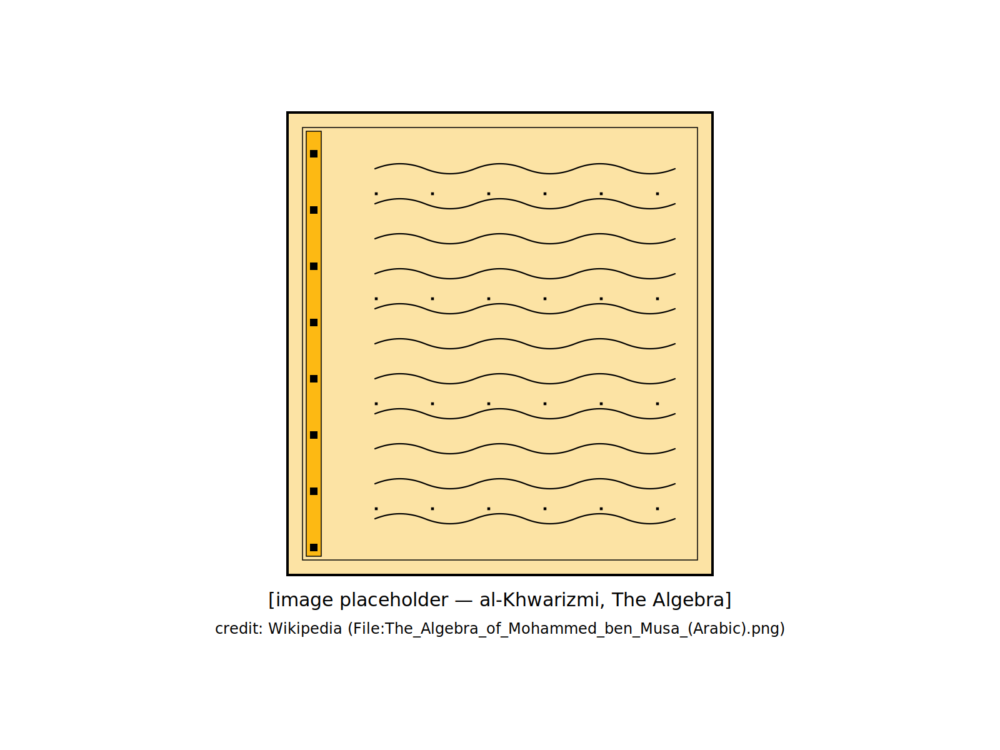
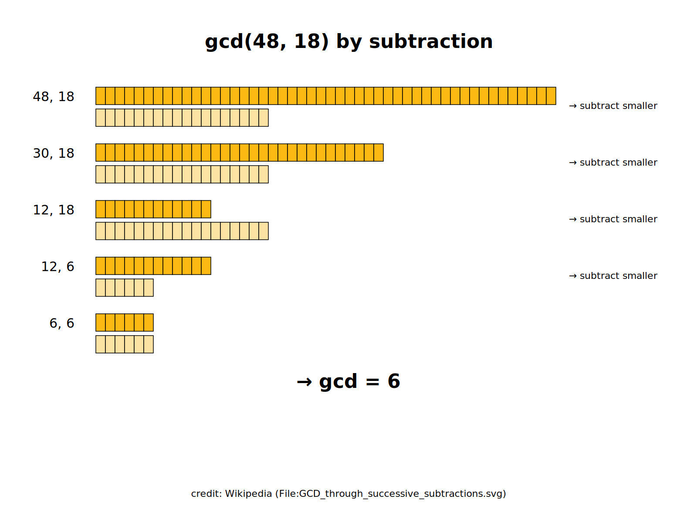

<!-- markdownlint-disable MD022 MD025 MD033 MD040 MD060 -->

  
Algorithms Side Quest

  

    Joshua MacDonald · May 28, 2026
  

  

---
section: 'I ❤️ Algorithms'
---

I ❤️ Algorithms

  

---
section: 'I ❤️ Algorithms'
---

  
How many ways to make

  
$1.00

  
from 5¢, 10¢, 25¢ coins?

---
section: 'I ❤️ Algorithms'
---

  
There's an algorithm.

  

---
section: 'I ❤️ Algorithms'
---

  
An algorithm is…

  

---
section: 'I ❤️ Algorithms'
---

  

---
section: 'I ❤️ Algorithms'
---

  <pre class="asq-code">p = 3
for i in range(1, 100):
    term = 4 / (2*i * (2*i+1) * (2*i+2))
    p += term * (-1)**(i+1)
print(p)</pre>
  
the Nilakantha series for computing π

---
section: 'I ❤️ Algorithms'
---

  
equations define solutions

  
they don't say how to find them

  

---
section: 'Every-day algorithms'
---

Every-day algorithms

  

---
section: 'Every-day algorithms'
---

  
refrigerator search

  <pre class="asq-code">problem   find the ketchup
&#10;algorithm
  1.  Pick any item.
  2.  Is it ketchup?  If yes, go to step 4.
  3.  Place it on the counter.  Go to step 1.
  4.  Return items to the refrigerator.</pre>

---
section: 'Every-day algorithms'
---

  
mowing a lawn

  <pre class="asq-code">problem     cover the entire lawn
&#10;algorithm   depends!</pre>

---
section: 'Every-day algorithms'
---

  
count the houses in town

  

---
section: 'Every-day algorithms'
---

  
searching   ·   sorting   ·   routing   ·   counting

  
how much time?

  
how much memory?

---
section: 'Counting exercises'
---

Counting exercises

  

---
section: 'Counting exercises'
---

  
decimal

  
digits 0 … 9

  
place values are powers of 10

  
5678₁₀ = 5·10³ + 6·10² + 7·10¹ + 8·10⁰

---
section: 'Counting exercises'
---

  
binary

  
digits 0 and 1

  
place values are powers of 2

  
1111₂ = 1·2³ + 1·2² + 1·2¹ + 1·2⁰

---
section: 'Counting exercises'
---

  
a bit

  
one binary place value

  
0    or    1

---
section: 'Counting exercises'
---

  
8 bits = 1 byte

  

---
section: 'Counting exercises'
---

  
2⁸ = 256

  

---
section: 'Counting exercises'
---

  

---
section: 'Counting exercises'
---

  
10 bits ≈ 3 decimal digits

  
2¹⁰ = 1,024

  
10³ = 1,000

  

    30 bits ≈ 1 billion
  

  

    60 bits ≈ 1 quintillion
  

  

    64 bits = 18,446,744,073,709,551,616
  

---
section: 'Change the problem'
---

Change the problem

  

---
section: 'Change the problem'
---

  
Travelling Salesman

  
  
no known fast algorithm

---
section: 'Change the problem'
---

  
fast Travelling Salesman   ⇒   fast Sudoku

  
  
thousands of problems in this class

---
section: 'Change the problem'
---

  
Euclid, c. 300 BC   ·   greatest common divisor

  <pre class="asq-code">// greatest common divisor of two numbers
func gcd2(a, b int) int {
    if b == 0 { return a }
    if a == 0 { return b }
    if a &gt; b { return gcd2(a-b, b) }
    return gcd2(a, b-a)
}</pre>
  
a recursive algorithm

---
section: 'Change the problem'
---

  <pre class="asq-code">// greatest common divisor of N numbers
func gcdN(a []int) int {
    if len(a) &lt; 2 { return a[0] }
    return gcd2(a[0], gcdN(a[1:]))
}</pre>
  

    gcd(5, 10, 25) = 5
  

  
$1.00 in { 5, 10, 25 }    ⇔    $0.20 in { 1, 2, 5 }

---
section: 'Counting from zero'
---

Counting from zero

  

---
section: 'Counting from zero'
---

  
ways to make $0.00 with 0 kinds of coins?   1

  
ways to make $0.00 with 1 kind of coin?   1

  
ways to make $0.00 with 2 kinds of coins?   1

  
axiom — all empty sets are the same

---
section: 'Counting from zero'
---

  
ways to make $0.20 with all pennies?   1

  
ways to make $0.19 with all pennies?   1

  
…

  
ways to make $0.01 with all pennies?   1

  
ways to make $0.00 with all pennies?   1

---
section: 'Counting from zero'
---

  
ways to make $0.00 with all 5¢ coins?   1

  
ways to make $0.01 with all 5¢ coins?   0

  
ways to make $0.02 with all 5¢ coins?   0

  
ways to make $0.03 with all 5¢ coins?   0

  
ways to make $0.04 with all 5¢ coins?   0

  
ways to make $0.05 with all 5¢ coins?   1

---
section: 'Counting from zero'
---

  

---
section: 'Counting from zero'
---

  
A   =   amount

  
K   =   number of coins so far

  
N   =   count of ways to make A with K

  
C   =   value of a K+1th coin

---
section: 'Counting from zero'
---

  
add coin C as the next coin

  
N ways to make A with K coins

  
N' ways to make A' with K+1 coins

  

---
section: 'Counting from zero'
---

  

---
section: 'Counting from zero'
---

  
above   ·   count to A without C is N

  
below   ·   count to A' with C is N'

  
with   ·   A' + C = A

  
then   ·   count to A with C is N + N'

  

