<!-- markdownlint-disable MD022 MD025 MD033 MD040 MD060 -->

  
Algorithms Side Quest

  

    Joshua MacDonald · May 28, 2026
  

  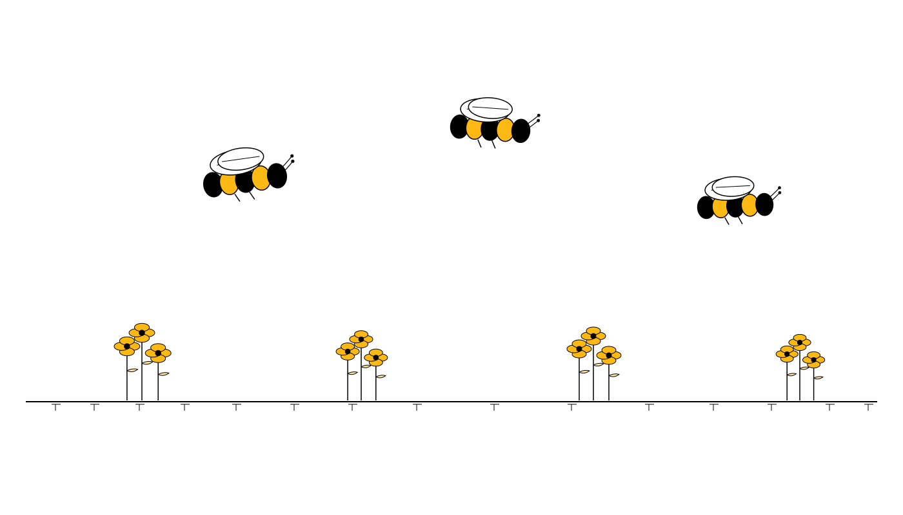

---
section: 'I ❤️ Algorithms'
---

I ❤️ Algorithms

  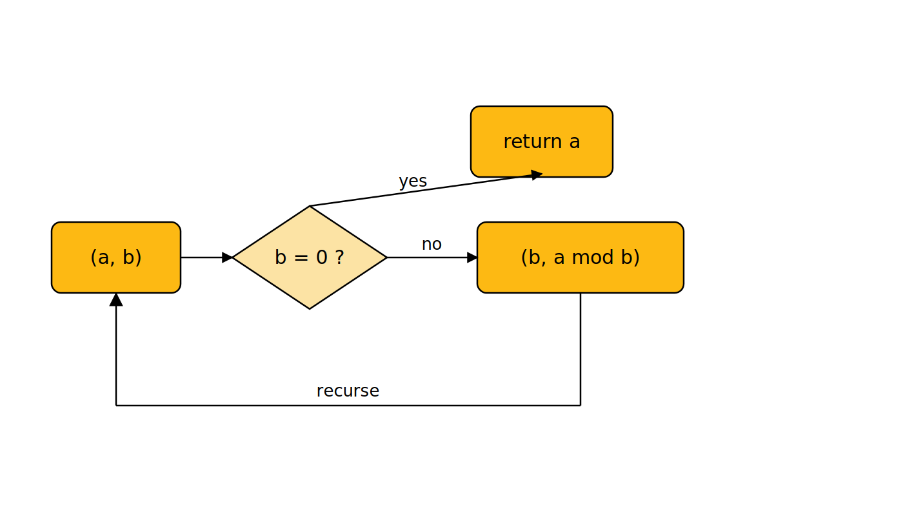

---
section: 'I ❤️ Algorithms'
---

  
How many ways to make

  
$1.00

  
from 5¢, 10¢, 25¢ coins?

---
section: 'I ❤️ Algorithms'
---

  
There's an algorithm.

  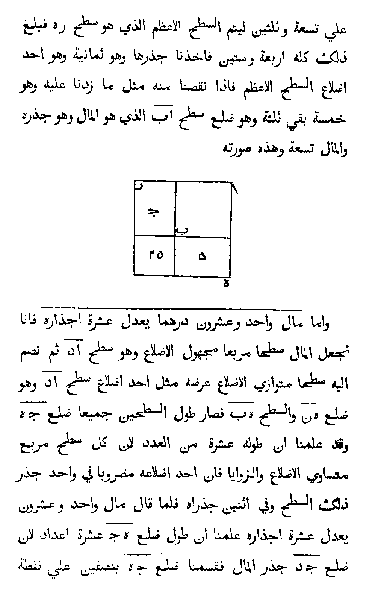
  
A page from <em>The Algebra of Mohammed ben Musa</em>, Fredrick Rosen, 1831 — public domain, via Wikimedia Commons

---
section: 'I ❤️ Algorithms'
---

  
An algorithm is…

  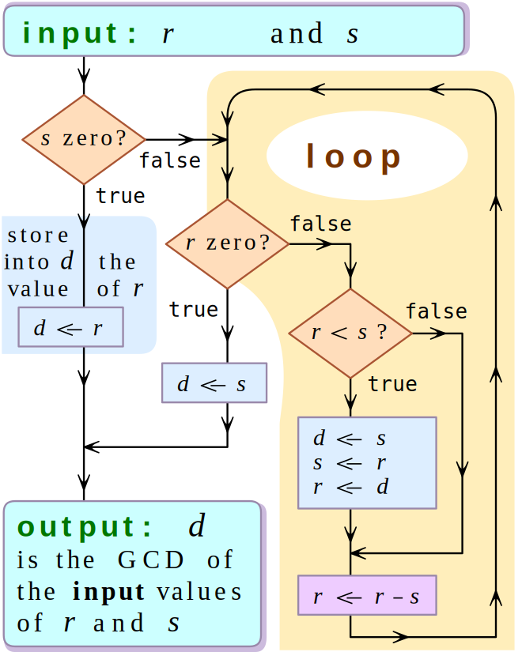
  
“GCD through successive subtractions” by Arthur Baelde — public domain, via Wikimedia Commons

---
section: 'I ❤️ Algorithms'
---

  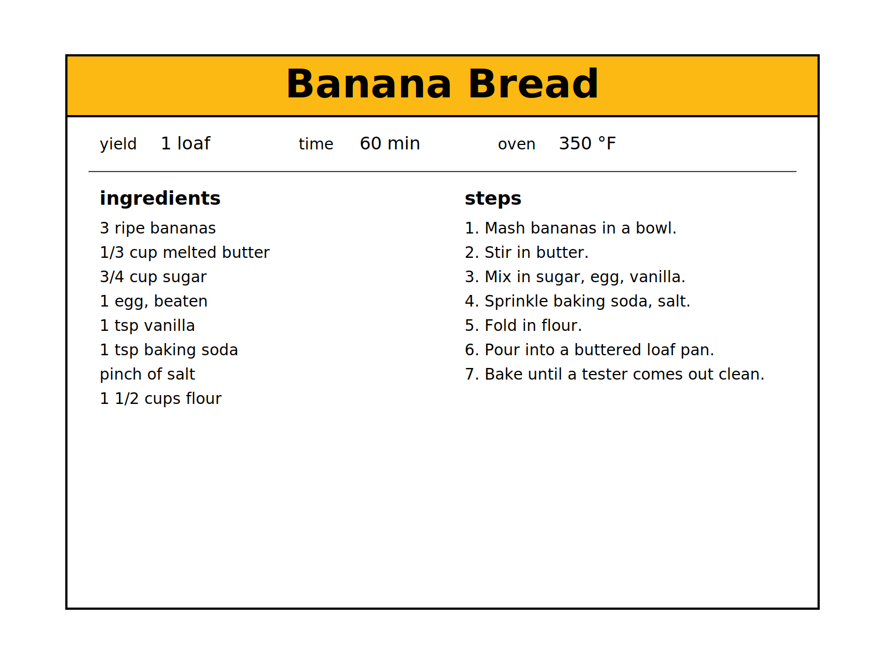

---
section: 'I ❤️ Algorithms'
---

  <pre class="asq-code">p = 3
for i in range(1, 100):
    term = 4 / (2*i * (2*i+1) * (2*i+2))
    p += term * (-1)**(i+1)
print(p)</pre>
  
the Nilakantha series for computing π

---
section: 'I ❤️ Algorithms'
---

  
equations define solutions

  
they don't say how to find them

  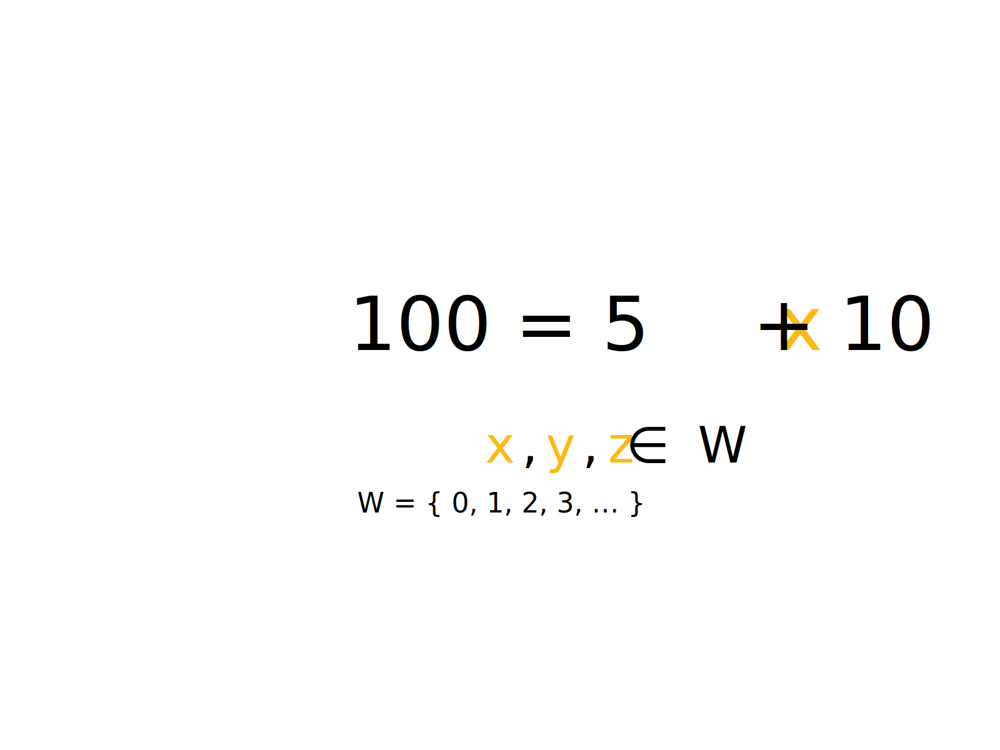

---
section: 'Every-day algorithms'
---

Every-day algorithms

  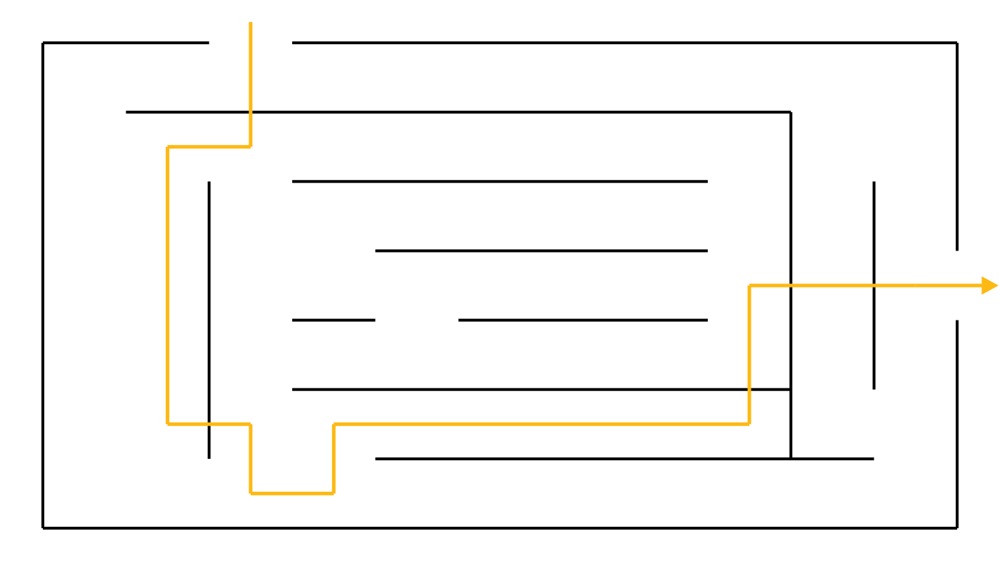

---
section: 'Every-day algorithms'
---

  
refrigerator search

  <pre class="asq-code">problem   find the ketchup
&#10;algorithm
  1.  Pick any item.
  2.  Is it ketchup?  If yes, go to step 4.
  3.  Place it on the counter.  Go to step 1.
  4.  Return items to the refrigerator.</pre>

---
section: 'Every-day algorithms'
---

  
mowing a lawn

  <pre class="asq-code">problem     cover the entire lawn
&#10;algorithm   depends!</pre>

---
section: 'Every-day algorithms'
---

  
count the houses in town

  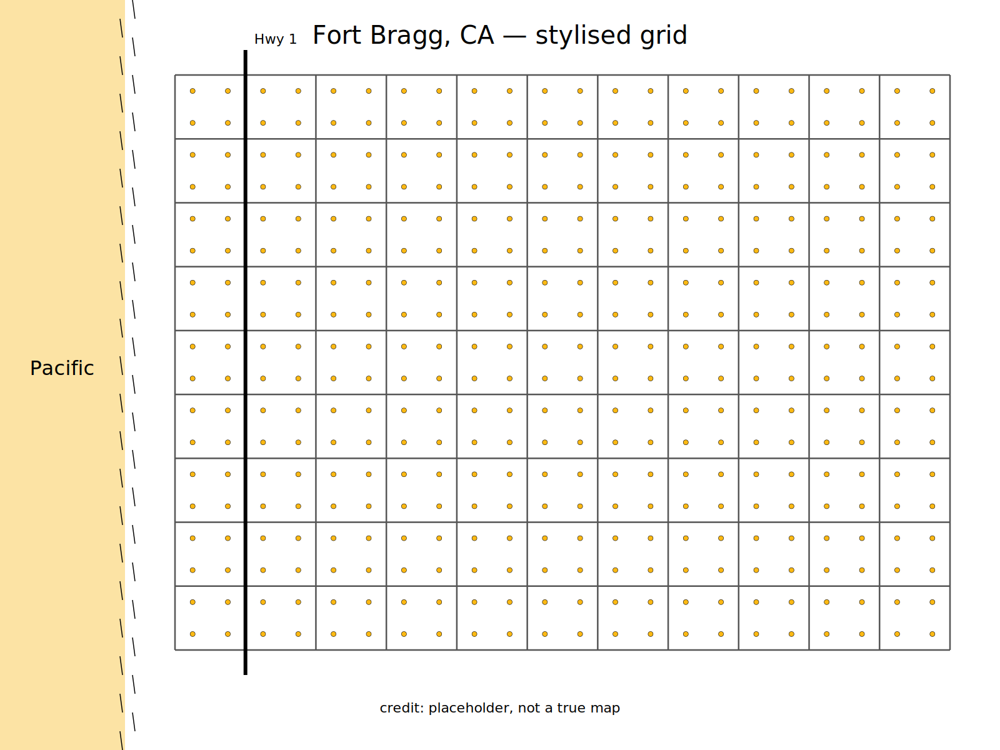

---
section: 'Every-day algorithms'
---

  
searching   ·   sorting   ·   routing   ·   counting

  
how much time?

  
how much memory?

---
section: 'Counting exercises'
---

Counting exercises

  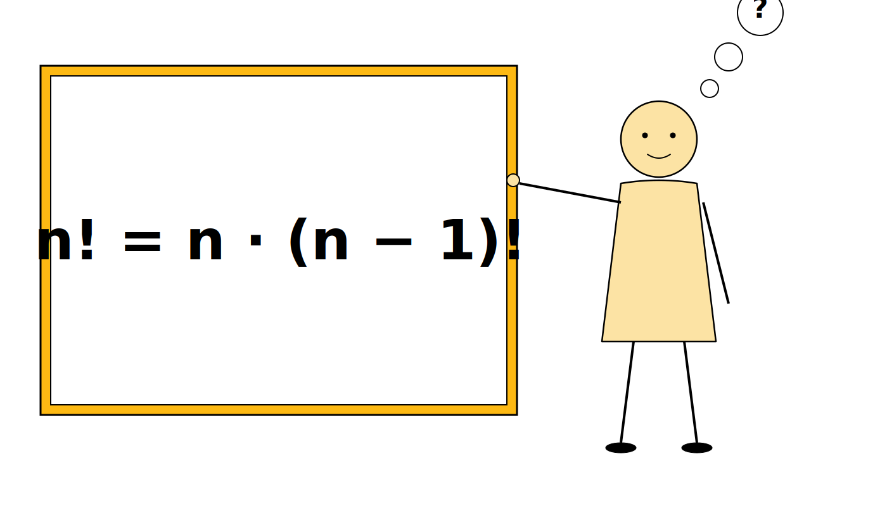

---
section: 'Counting exercises'
---

  
decimal

  
digits 0 … 9

  
place values are powers of 10

  
5678₁₀ = 5·10³ + 6·10² + 7·10¹ + 8·10⁰

---
section: 'Counting exercises'
---

  
binary

  
digits 0 and 1

  
place values are powers of 2

  
1111₂ = 1·2³ + 1·2² + 1·2¹ + 1·2⁰

---
section: 'Counting exercises'
---

  
a bit

  
one binary place value

  
0    or    1

---
section: 'Counting exercises'
---

  
8 bits = 1 byte

  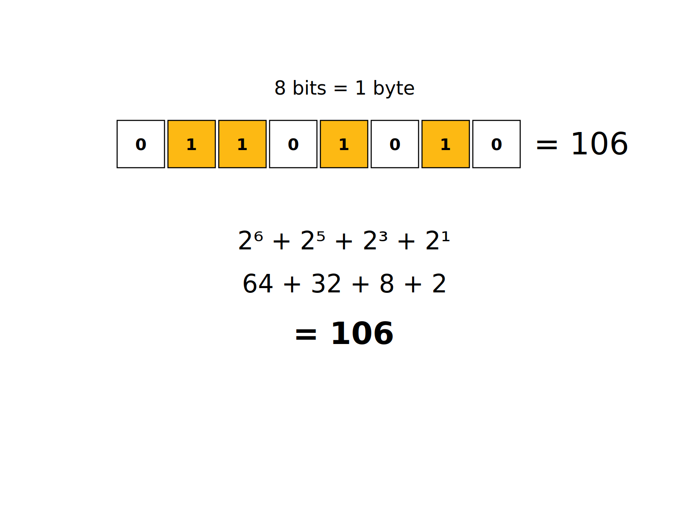

---
section: 'Counting exercises'
---

  
2⁸ = 256

  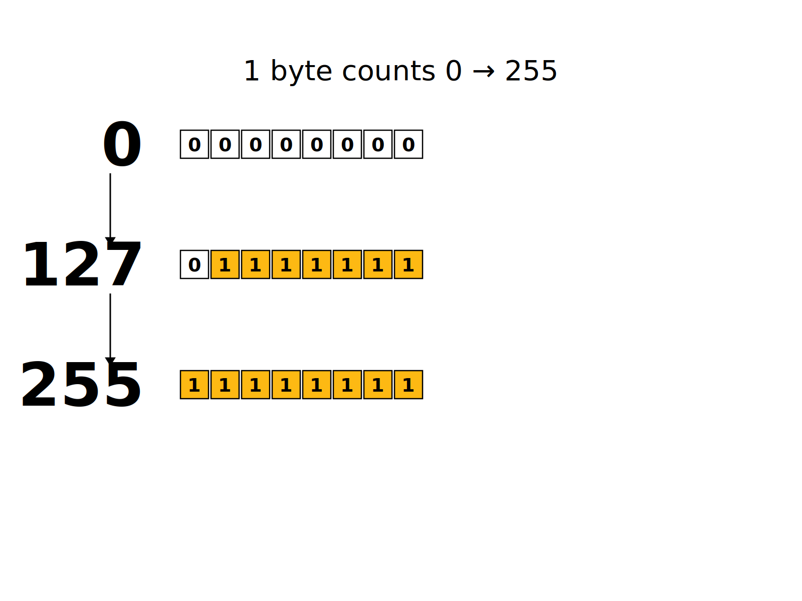

---
section: 'Counting exercises'
---

  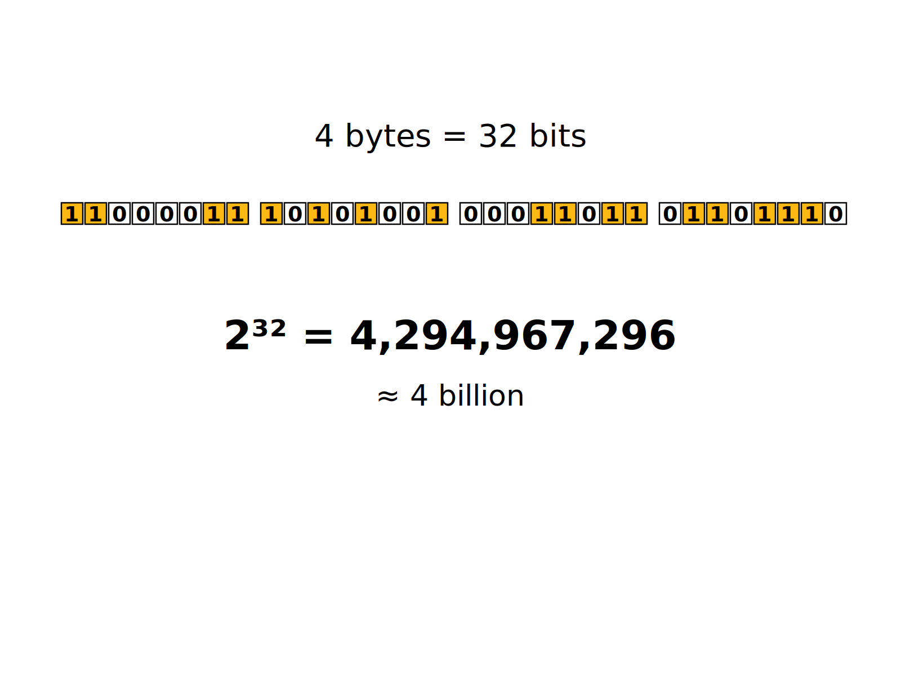

---
section: 'Counting exercises'
---

  
10 bits ≈ 3 decimal digits

  
2¹⁰ = 1,024

  
10³ = 1,000

  

    30 bits ≈ 1 billion
  

  

    60 bits ≈ 1 quintillion
  

  

    64 bits = 18,446,744,073,709,551,616
  

---
section: 'Counting exercises'
---

  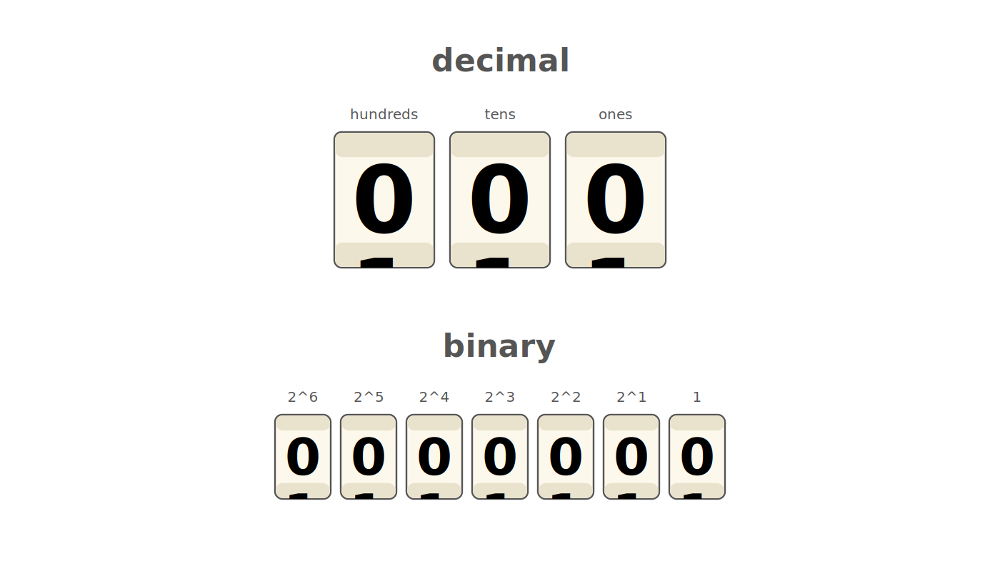

---
section: 'Change the problem'
---

Change the problem

  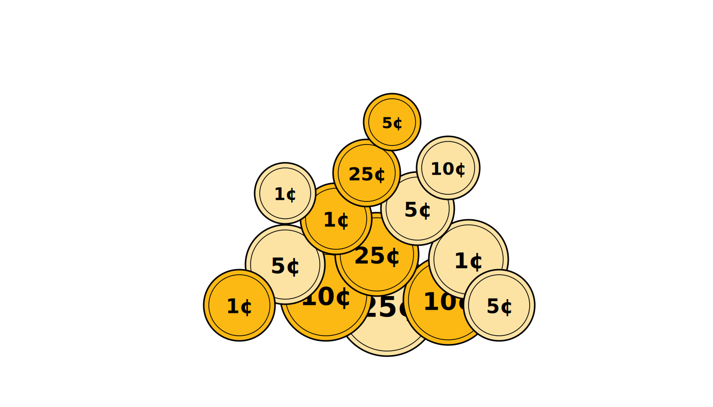

---
section: 'Change the problem'
---

  
Travelling Salesman

  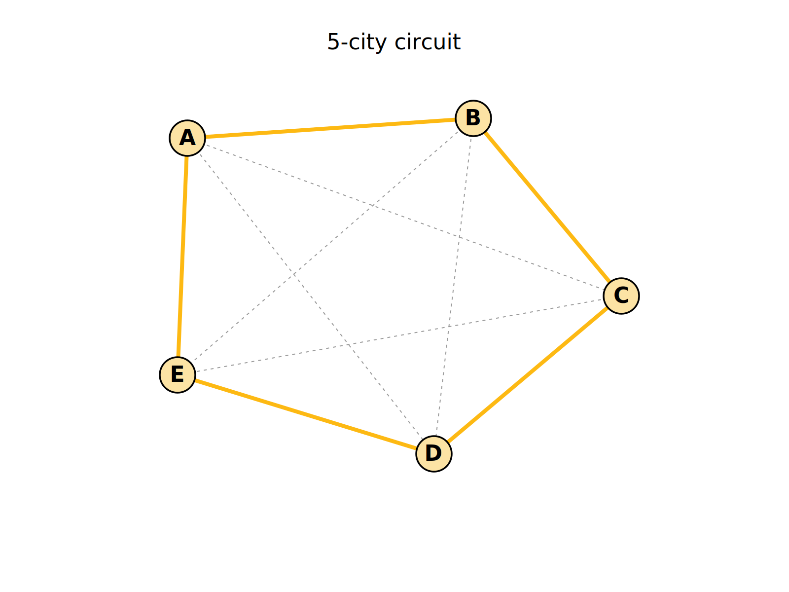
  
no known fast algorithm

---
section: 'Change the problem'
---

  
fast Travelling Salesman   ⇒   fast Sudoku

  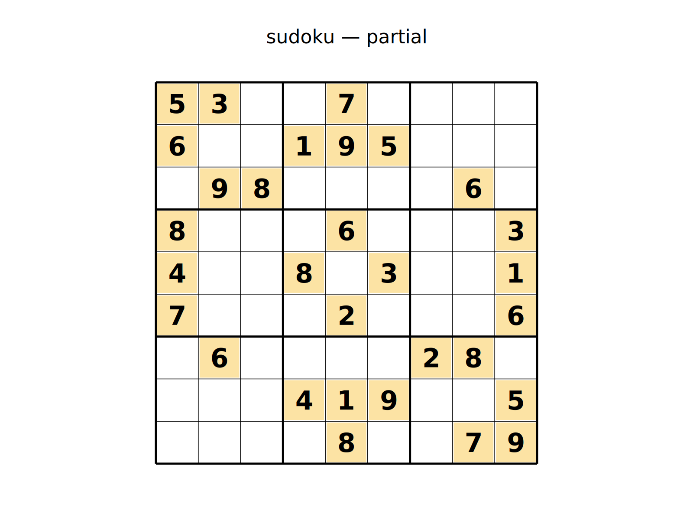
  
thousands of problems in this class

---
section: 'Change the problem'
---

  
Euclid, c. 300 BC   ·   greatest common divisor

  <pre class="asq-code">// greatest common divisor of two numbers
func gcd2(a, b int) int {
    if b == 0 { return a }
    if a == 0 { return b }
    if a &gt; b { return gcd2(a-b, b) }
    return gcd2(a, b-a)
}</pre>
  
a recursive algorithm

---
section: 'Change the problem'
---

  

    gcd(5, 10, 25, 100) = 5
  

  

    $1.00 made from {5¢, 10¢, 25¢} 
    ⇔ 
    $0.20 made from {1¢, 2¢, 5¢}
  

  <pre class="asq-code" style="margin-top: 1.8rem;">// greatest common divisor of N numbers
func gcdN(a ...int) int {
    if len(a) &lt; 2 { return a[0] }
    return gcd2(a[0], gcdN(a[1:]...))
}</pre>

---
section: 'Counting from zero'
---

Counting from zero

  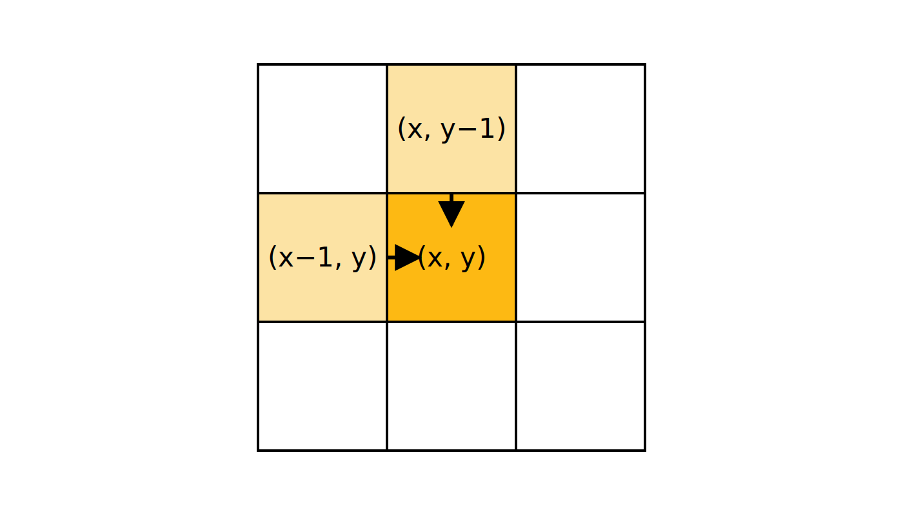

---
section: 'Counting from zero'
---

  

    
ways to make $0.00 with 0 different coins?

    
1

    
ways to make $0.00 with 1 different coins?

    
1

    
ways to make $0.00 with 2 different coins?

    
1

  

  
axiom — all empty sets are the same

---
section: 'Counting from zero'
---

  
ways to make $0.20 with all pennies?   1

  
ways to make $0.19 with all pennies?   1

  
…

  
ways to make $0.01 with all pennies?   1

  
ways to make $0.00 with all pennies?   1

---
section: 'Counting from zero'
---

  
ways to make $0.00 with all 5¢ coins?   1

  
ways to make $0.01 with all 5¢ coins?   0

  
ways to make $0.02 with all 5¢ coins?   0

  
ways to make $0.03 with all 5¢ coins?   0

  
ways to make $0.04 with all 5¢ coins?   0

  
ways to make $0.05 with all 5¢ coins?   1

---
section: 'Counting from zero'
---

  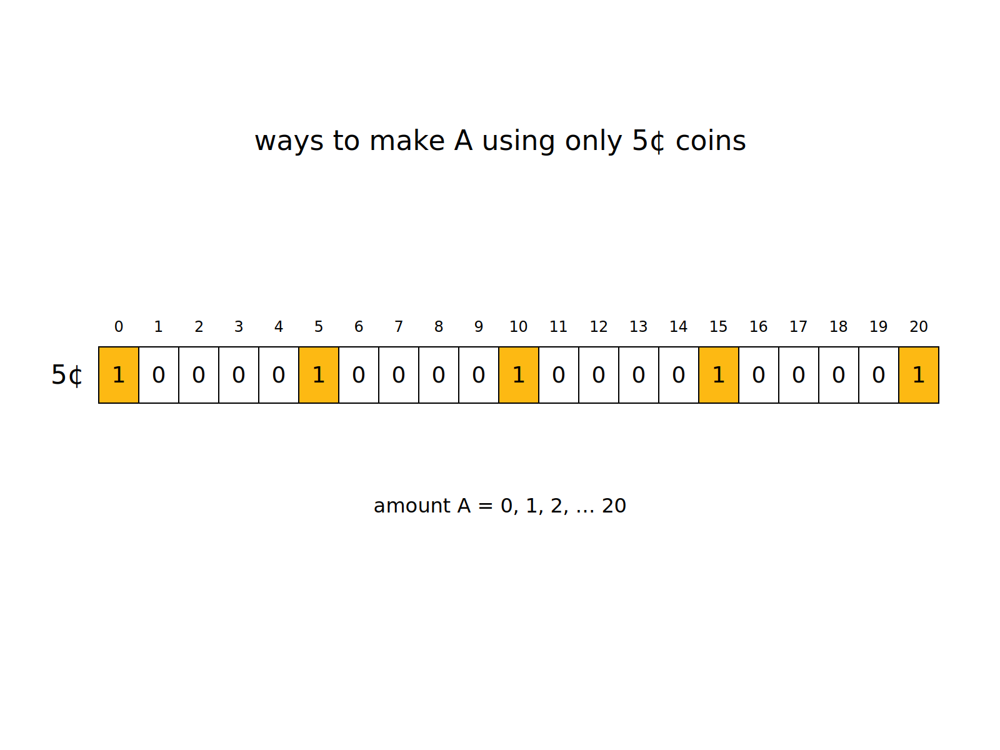

---
section: 'Counting from zero'
---

  
A   =   amount

  
K   =   number of coins so far

  
N   =   count of ways to make A with K

  
C   =   value of a K+1th coin

---
section: 'Counting from zero'
---

  
add coin C as the next coin

  
N ways to make A with K coins

  
N' ways to make A' with K+1 coins

  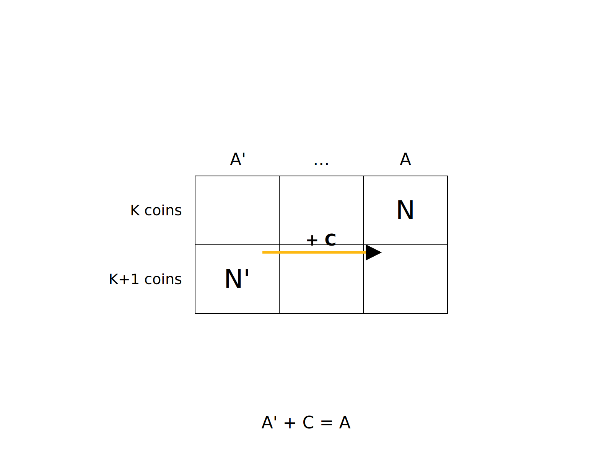

---
section: 'Counting from zero'
---

  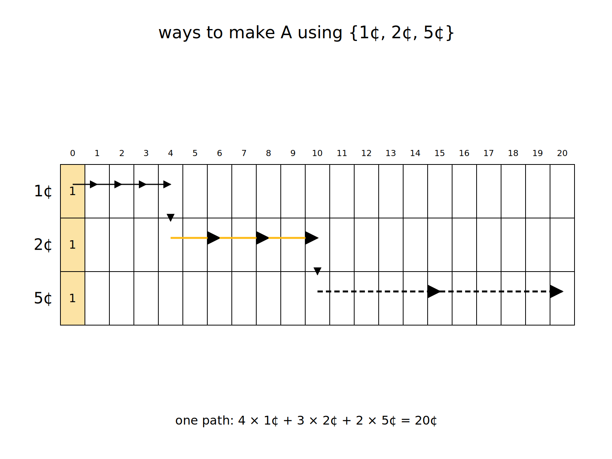

---
section: 'Counting from zero'
---

  

    
in the row above

    
count to A without the new coin C is N

  

  

    
in the row below

    
count to A' with the new coin C is N'

  

  

    
with

    
A' + C = A

  

  

    
then

    
count to A with the new coin is N + N'

  

  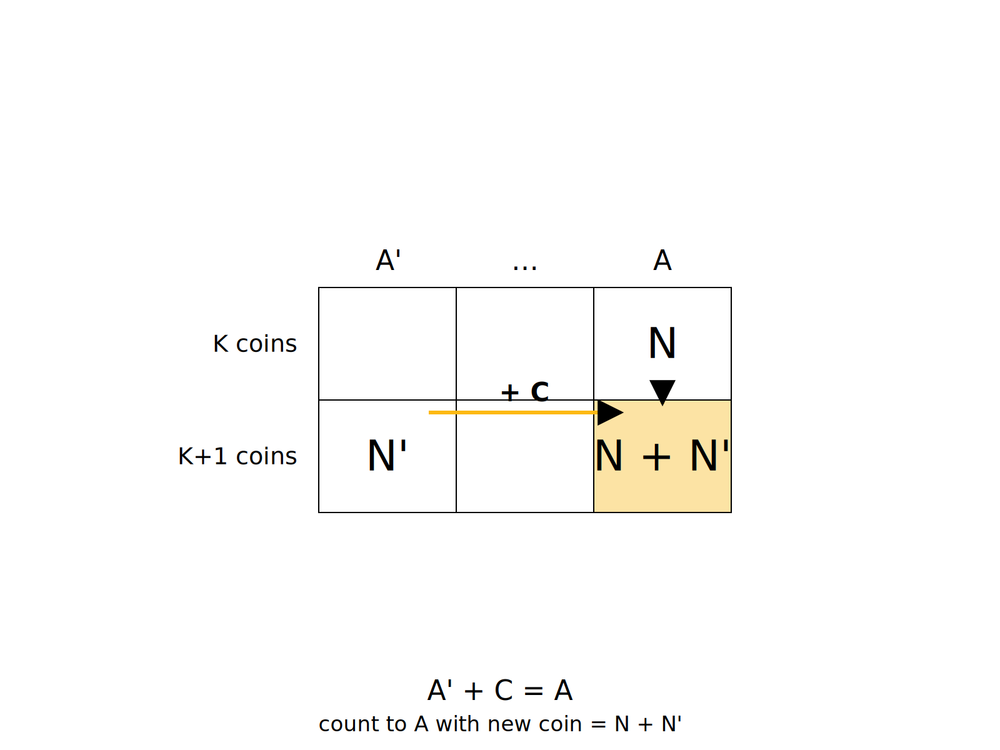

---
section: 'Counting from zero'
---

  

---
section: 'Counting from zero'
---

  

---
section: 'Counting from zero'
---

  
Path iteration

  
coin order &nbsp;·&nbsp; 5¢ → 2¢ → 1¢

  

---
section: 'Counting from zero'
---

  
Path iteration

  
coin order &nbsp;·&nbsp; 1¢ → 2¢ → 5¢

  

---
section: 'Counting from zero'
---

  
Counting paths

  
coin order &nbsp;·&nbsp; 5¢ → 2¢ → 1¢

  

---
section: 'Counting from zero'
---

  
Counting paths

  
coin order &nbsp;·&nbsp; 1¢ → 2¢ → 5¢

  

---
section: 'Counting from zero'
---

  
Counting-change family

  
same algorithm, different problem

  
compute similarity

  
autocomplete &nbsp;·&nbsp; DNA analysis

  
solve the shortest-edit problem

---
section: 'Art and Science'
---

Art and Science

  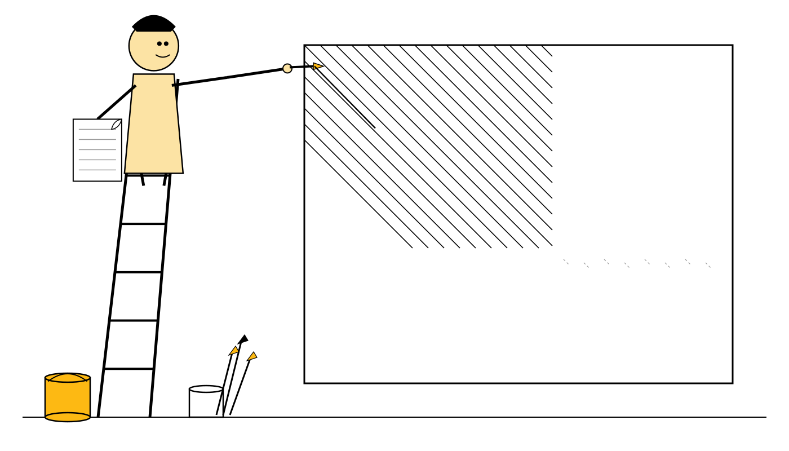

---
section: 'Art and Science'
---

  
Sol LeWitt

  
1928 – 2007 &nbsp;·&nbsp; conceptual art

  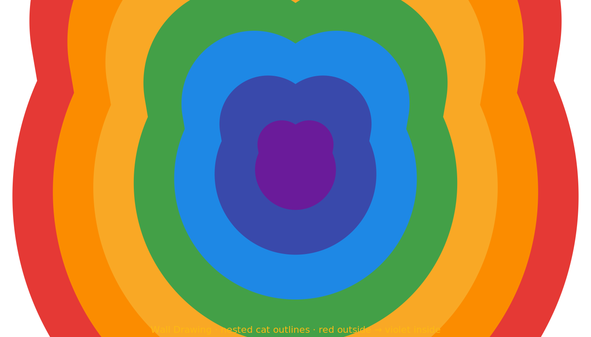
  
wall-drawing specifications, installed by others &mdash; "as if by machine"

---
section: 'Art and Science'
---

  
Donald Knuth

  
b. 1938 &nbsp;·&nbsp; <em>The Art of Computer Programming</em>

  
  
literate programming &mdash; formal and informal text, machine-executable and human-readable

  
"Algorithm" illustration, Wikipedia &mdash; public-domain math rendering

---
section: 'Art and Science'
---

  
Made with AI

  
LeWitt's idea was to specify art so the artifact could be made without skill.

  
Knuth's idea was that computer programs made with only skill are not art.

  
I wrote a specification for these slides &mdash;

  
a very-skilled, lifeless artist made them

  

    <a href="https://github.com/jmacd/algorithms-side-quest/blob/main/README.md">github.com/jmacd/algorithms-side-quest</a>
  

---
section: 'Art and Science'
---

  
About the title

  
video games &nbsp;&middot;&nbsp; so many algorithms

  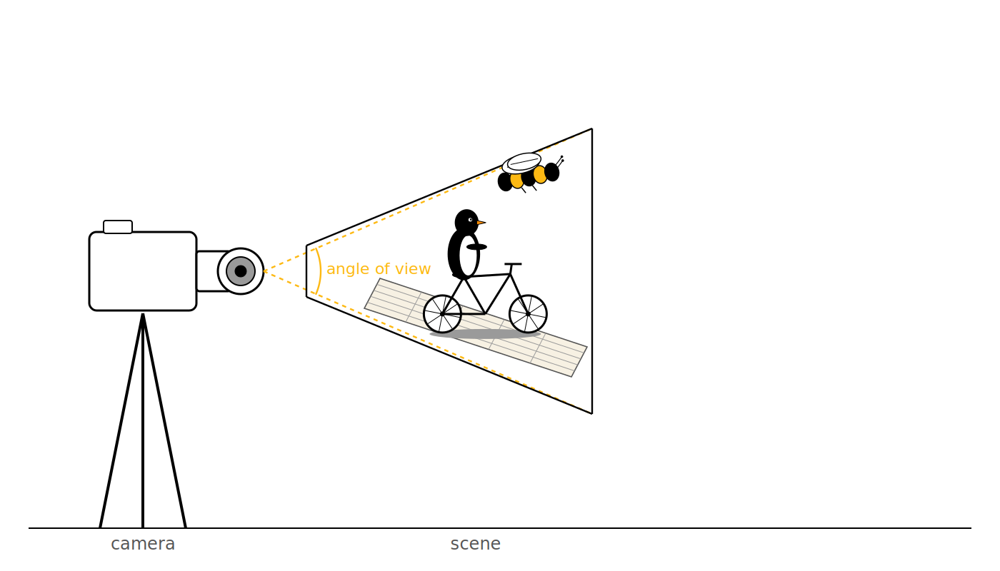

